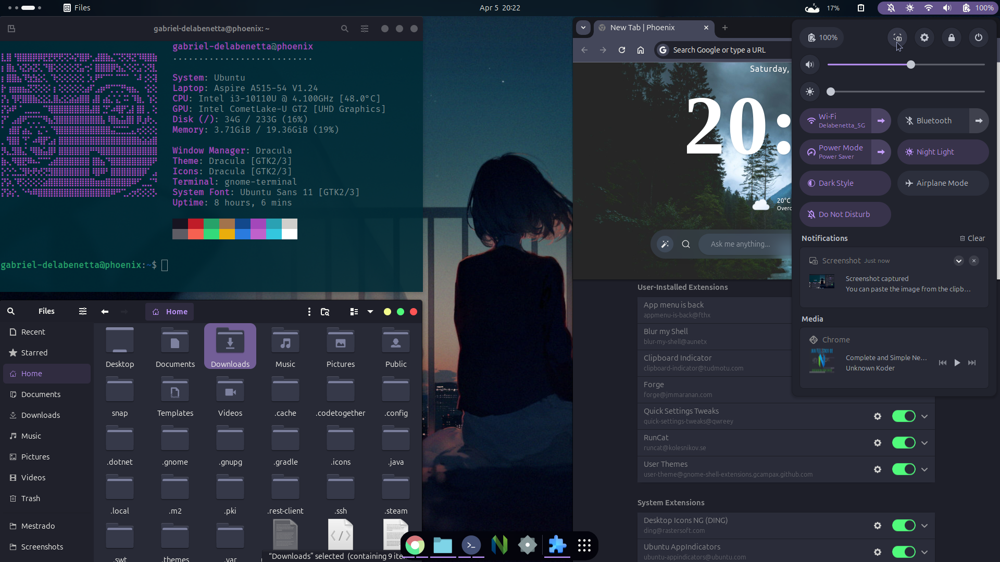
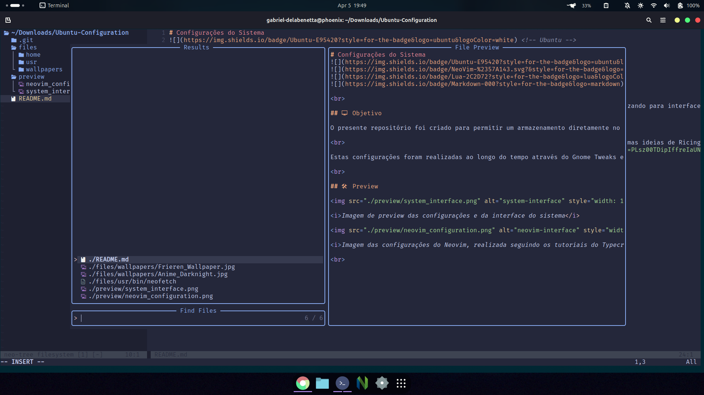

## Configurações do Sistema
 <!-- Ubuntu -->
 <!-- Neovim -->
 <!-- Lua -->
 <!-- README -->

 

## 🖵  Objetivo

O presente repositório foi criado para permitir um armazenamento diretamente no GitHub das configurações gerais que vou utilizando para interface do meu sistema e para configurar algumas aplicações - como Neovim e o Terminal do Ubuntu.

 

Estas configurações foram realizadas ao longo do tempo através do Gnome Tweaks e do Extension Manager, bem como seguindo algumas ideias de Ricing através do Reddit. A configuração do Neovim foi realizada seguindo a série do <a href="https://www.youtube.com/playlist?list=PLsz00TDipIffreIaUNk64KxTIkQaGguqn">Typecraft no YouTube</a>, onde são apresentados os conceitos e ensinados os "por quês" de cada configuração.

 

## 🛠 Preview

<i>Imagem de preview das configurações e da interface do sistema</i>

<i>Imagem das configurações do Neovim, realizada seguindo os tutoriais do Typecraft</i>

 
